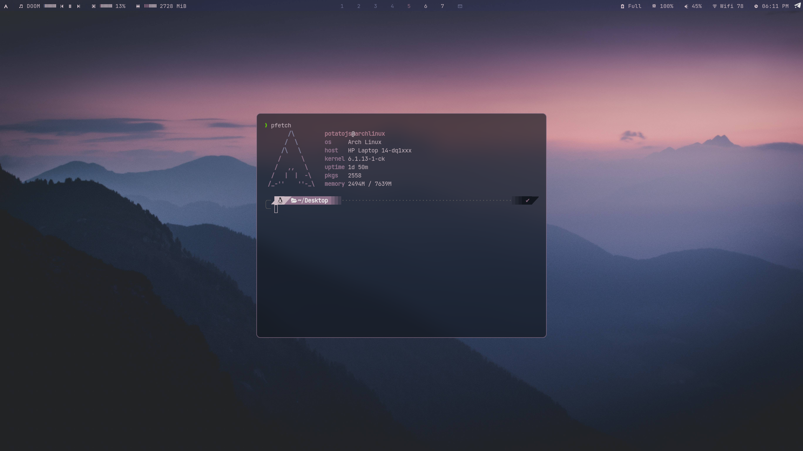
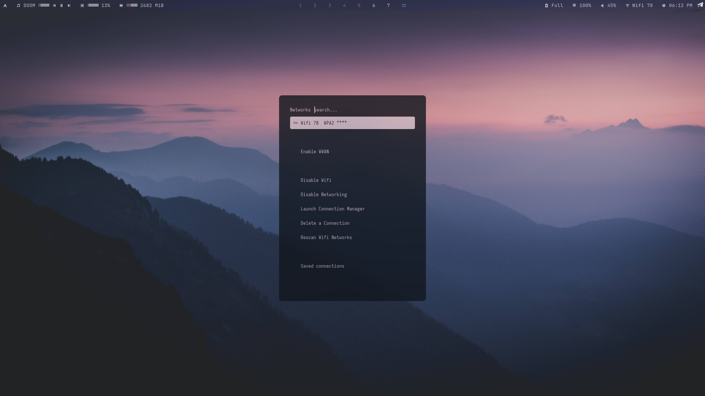
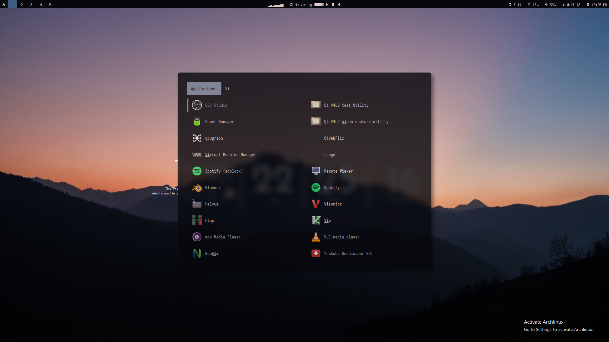

Bspwm Dots







#### pywal core dependency

# WALLPAPERS

WALLPAPERS are not included create a folder called `wallpaper` in the bspwm
folder

```bash
mkdir ~/.config/bspwm/wallpaper/
```

and put your wallpaper there, it should be in a `png` format only\
there should a wallpaper there called `wallpaper.png` which is the main
wallpaper\
to switch `wallpapers/themes` use `super + shift + t` and pick the wallpaper
name\
the first 3 are pywal engines, everything below that is a png from the wallpaper
folder

### SETUP

- **run** `.install.sh` to install and configure [ compulsory ]

###### a pywal generation is complusory `wal -i path/to/img`

- **Installation** :
  \
  move everything to `~/.config/bspwm/`\
  move `~/.config/bspwm/others/config.ini` to\
  `~/.config/networkmanager-dmenu/config.ini`

#### DEPS

> Apps

- install command :

```shell
sudo pacman -S rofi polybar alacritty dunst feh \
xcb-util-cursor xsettingsd mpc mpd dmenu ncmpcpp \
networkmanager-dmenu-git light python-gobject \
xfce4-power-manager maim xclip xorg-xbacklight \
viewnior conky python-pywal xdg-user-dirs --noconfirm
```

```shell
cava is needed for the polybar visualizer, but isn't in the pacman repos use the AUR
```

- List:

```shell
rofi
polybar
alacritty
dunst
picom # jhonaburg picom
feh
python-pywal
mpc
dmenu
light
networkmanager
networkmanager-dmenu-git
python-gobject
xfce4-power-manager
maim
viewnior
xorg-backlight
xclip
cava
conky
xdg-user-dirs
```

> Fonts

- located in `./others/fonts/`

```shell
sudo mv ~/.config/bspwm/others/fonts/* /usr/share/fonts/
```

- List

```shell
Iosevka
JetBrains Mono Nerd Fonts
Siji
Terminus
waffle
```

> **Other setups**

- move `~/.config/bspwm/others/config.ini` to
  `~/.config/networkmanager-dmenu/config.ini`

## USEFUL KEYBINDS

> For all KEYBINDS check the sxhkdrc file in `~/.config/bspwm`

- **Keywords**
  > W = Windows key\
  > C = Ctrl\
  > A = Alt\
  > T = Tab\
  > S = Shift\
  > R = Enter

#### WINDOW MANAGEMENT

| key                    | function                          |
| ---------------------- | --------------------------------- |
| W + h,j,k,l            | Move focus { left,down,up,right } |
| W + up,down,left,right | Move focus { left,down,up,right } |
| W + S + j,k            | { grow , shrink } focused window  |
| W + 1 -> 9             | Move to workspace 1 -> 9          |
| W + }                  | Create Virtical space(Right)      |
| W + {                  | Create Virtical space(Left)       |
| W + ;                  | Create horizontal space(bottom)   |
| W + '                  | Create horizontal space(top)      |

#### Rofi

| key       | Menu              |
| --------- | ----------------- |
| W + d     | app menu          |
| W + S + d | app menu (small)  |
| W + n     | network menu      |
| W + t     | Todo note         |
| W + S + t | theme picker menu |

#### APPS

| key       | Application            |
| --------- | ---------------------- |
| W + R     | terminal ( alacritty ) |
| W + S + R | floatting terminal     |
| W + w     | Firefox                |
| W + S + w | Firefox                |
| W + S + z | Discord                |
| W + S + a | Telegram               |

### Music

| Key       | Action                   |
| --------- | ------------------------ |
| W + p     | play / pause             |
| W + '+'   | volume increase          |
| W + '-'   | volume decrease          |
| W + m     | toggle mute              |
| W + S + > | music(mpd) next          |
| W + S + < | music(mpd) previous      |
| W + '>'   | music(mpd) seek forward  |
| W + '<'   | music(mpd) seek backward |
