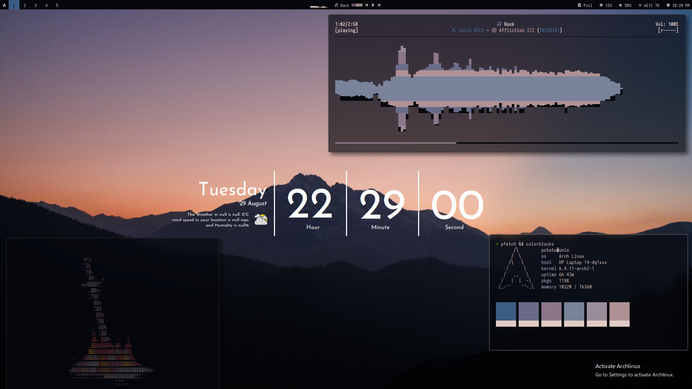

# Bspwm Dots




### SETUP

- **Installation** : \
  move everything to `~/.config/bspwm/`

#### DEPS

> Apps

- install command :

```shell
sudo pacman -S rofi polybar alacritty dunst feh \
xcb-util-cursor xsettingsd mpc mpd dmenu ncmpcpp \
networkmanager-dmenu-git light python-gobject \
xfce4-power-manager maim xclip xorg-xbacklight \
viewnior --noconfirm

```

- List:

```shell
rofi
polybar
alacritty
dunst
picom # jhonaburg picom
feh
wal
mpc
dmenu
light
networkmanager
networkmanager-dmenu-git
python-gobject
xfce4-power-manager
maim
viewnior
xorg-backlight
xclip
```

> Fonts

- located in `./others/fonts/`

```shell
sudo mv ~/.config/bspwm/others/fonts/* /usr/share/fonts/
```

- List

```shell
Iosevka
JetBrains Mono Nerd Fonts
Siji
Terminus
waffle
```

> **Other setups**

- move `~/.config/bspwm/others/config.ini` to `~/.config/networkmanager-dmenu/config.ini`

## USEFUL KEYBINDS

- **Keywords**
  > W = Windows key \
  > C = Ctrl \
  > A = Alt \
  > T = Tab \
  > S = Shift \
  > R = Enter \

#### WINDOW MANAGEMENT

| key                    | function                          |
| ---------------------- | --------------------------------- |
| W + h,j,k,l            | Move focus { left,down,up,right } |
| W + up,down,left,right | Move focus { left,down,up,right } |
| W + S + j,k            | { grow , shrink } focused window  |
| W + 1 -> 9             | Move to workspace 1 -> 9          |

#### APPS

| key           | Application            |
| ------------- | ---------------------- |
| W + R         | terminal ( alacritty ) |
| W + S + R     | floatting terminal     |
| W + w         | Firefox                |
| W + S + w     | Firefox                |
| W + S + z     | Discord                |
| W + S + a     | Telegram               |
| W + n         | Rofi Network manaager  |
| W + d         | Rofi app menu          |
| W + shift + d | Rofi app menu 2        |
